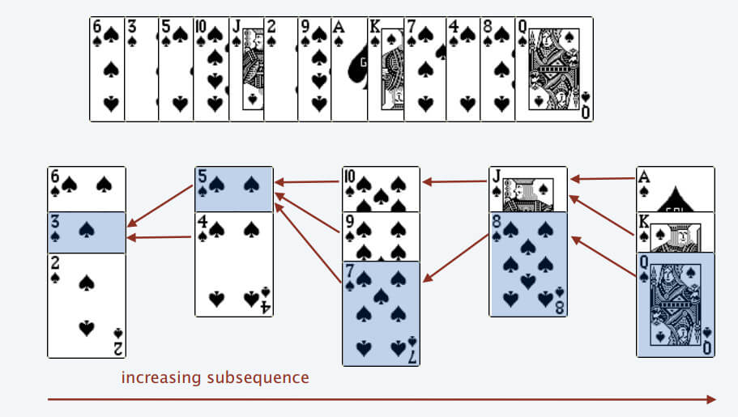

# 动态规划

[TOC]

## 背包问题

### 背包dp例题

bitset优化

链接：https://ac.nowcoder.com/acm/problem/17193?&headNav=acm
来源：牛客网

$$ 一共有 n个数，第 i 个数是 x_i ,  x_i 可以取 [l_i , r_i] 中任意的一个值。  设 S=\sum x_i^2,求 S 种类数。$$
$$
设dp[i][j] = 前i个数的平方和能否等于j。则dp[i][j] = dp[i-1][j - x_i^2]，可以用bitset优化
$$

```c++
//
// Created by jiang on 2020/8/16.
// https://ac.nowcoder.com/acm/problem/17193?&headNav=acm

#include <cstdio>
#include <bitset>

std::bitset<1000001> dp[101];

int main() {
    int n, l, r;
    scanf("%d", &n);
    dp[0][0] = true;
    for (int i = 1; i <= n; ++i) {
        scanf("%d %d", &l, &r);
        for (int j = l; j <= r; ++j) {
            dp[i] |= dp[i-1] << (j*j);
        }
    }
    printf("%zu\n", dp[n].count());
    return 0;
}
```

### 二维背包

leetcode 879 盈利计划

集团里有 n 名员工，他们可以完成各种各样的工作创造利润。

第 i 种工作会产生 profit[i] 的利润，它要求 group[i] 名成员共同参与。如果成员参与了其中一项工作，就不能参与另一项工作。

工作的任何至少产生 minProfit 利润的子集称为盈利计划。并且工作的成员总数最多为 n 。

有多少种计划可以选择？因为答案很大，所以 返回结果模 10^9 + 7 的值。

来源：力扣（LeetCode）
链接：https://leetcode-cn.com/problems/profitable-schemes

```python
#利润背包，可以溢出
for p in ps: 
    for i in range(P+p, p-1, -1):
        dp[min(i,P)] += dp[i-n]
#人员背包，不能溢出
for g in gs: 
    for i in range(G, g-1, -1):
        dp[i] += dp[i-n]

# 二维背包
for p, g in zip(profit, group):
    for i in range(P+p, p-1, -1): 
        for j in range(G , g-1, -1):
            # 利润超过P的也放在 dp[P] 里 方便最后的统计
            dp[min(P,i)][j] += dp[i-p][j-g]

# 题解
class Solution:
    def profitableSchemes(self, G: int, P: int, group: List[int], profit: List[int]) -> int:
        # dp[P][G] 达到P利润，需要的人数G 的方法数
        dp = [[0] * (N + 1)  for _ in range(P + 1)]
        dp[0][0] = 1
        for p, g in zip(profit, group):
            for i in range(P+p, p-1, -1):
                for j in range(G , g-1, -1):
                    dp[min(P,i)][j] += dp[i-p][j-g]
        return sum(dp[P]) % (10 ** 9 + 7)

```


```cpp
class Solution {
public:
	int profitableSchemes(int n, int minProfit, vector<int> &group, vector<int> &profit) {
		vector<vector<long long>> dp(minProfit + 1, vector<long long>(n + 1, 0));
		dp[0][0] = 1;
		for (int i = 0; i < group.size(); ++i) {
            // 二维背包 两重for循环可以交换位置
			for (int j = n; j >= group[i]; --j) {
				for (int k = minProfit + profit[i]; k >= profit[i]; --k) {
					dp[std::min(k, minProfit)][j] += dp[k - profit[i]][j - group[i]];
				}
			}
		}
		long long ans = 0;
		for (int i = 0; i <= n; ++i) {
			ans = (ans + dp[minProfit][i]) % 1000000007;
		}
		return (int)ans;
	}
};

```

## 最长公共子串 [interview]

dp[i][j]表示在str1中以第i个字符结尾，在str2中以第j个字符结尾时的公共子串长度。

$$
dp(i, j) = \begin{cases}
dp(i-1, j-1) + 1 & str1[i] = str2[j] \\
0 & str1[i] \neq str2[j]
\end{cases}
$$

牛客 NC127 最长公共子串
```cpp
class Solution {
public:
    string LCS(string str1, string str2) {
        //dp[i][j]表示到str1第i个个到str2第j个为止的公共子串长度
        vector<vector<int> > dp(str1.length() + 1, vector<int>(str2.length() + 1, 0)); 
        int max = 0;
        int pos = 0;
        for(int i = 1; i <= str1.length(); i++){
            for(int j = 1; j <= str2.length(); j++){
                //如果该两位相同
                if(str1[i - 1] == str2[j - 1]){ 
                    //则增加长度
                    dp[i][j] = dp[i - 1][j - 1] + 1; 
                }
                else{ 
                    //该位置为0
                    dp[i][j] = 0; 
                }
                //更新最大长度
                if(dp[i][j] > max){ 
                    max = dp[i][j];
                    pos = i - 1;
                }
            }
        }
        return str1.substr(pos - max + 1, max);
    }
};
```

## 最长公共子序列 [interview]

f(i, j)表示只考虑序列A前i个元素，序列B前j个元素的最长公共子序列时的长度。

$$
f(i, j) = \begin{cases}
f(i-1, j-1) + 1 & A[i] = B[j] \\
max(f(i-1, j), f(i, j-1)) & A[i] \neq B[j]
\end{cases}
$$

如果要输出最长公共子序列，可以根据dp数组逆推。

牛客BM65 最长公共子序列(二)
```cpp
class Solution {
public:
    string LCS(string s1, string s2) {
        //只要有一个空字符串便不会有子序列
        if(s1.length() == 0 || s2.length() == 0) 
            return "-1";
        int len1 = s1.length();
        int len2 = s2.length();
        //dp[i][j]表示第一个字符串到第i位，第二个字符串到第j位为止的最长公共子序列长度
        vector<vector<int>> dp(len1 + 1, vector<int>(len2 + 1, 0)); 
        //遍历两个字符串每个位置求的最长长度
        for(int i = 1; i <= len1; i++){
            for(int j = 1; j <= len2; j++){
                //遇到两个字符相等
                if(s1[i - 1] == s2[j -1])
                    //来自于左上方
                    dp[i][j] = dp[i - 1][j - 1] + 1;
                //遇到的两个字符不同
                else
                    //来自左边或者上方的最大值
                    dp[i][j] = max(dp[i - 1][j], dp[i][j - 1]);
            }
        }
        //从动态规划数组末尾开始
        int i = len1, j = len2;
        stack<char> s;
        while(dp[i][j]){
            //来自于左方向
            if(dp[i][j] == dp[i - 1][j])
                i--;
            //来自于上方向
            else if(dp[i][j] == dp[i][j - 1])
                j--;
            //来自于左上方向
            else if(dp[i][j] > dp[i - 1][j - 1]){
                i--;
                j--;
                //只有左上方向才是字符相等的情况，入栈，逆序使用
                s.push(s1[i]); 
           }
        }
        string res = "";
        //拼接子序列
        while(!s.empty()){
            res += s.top();
            s.pop();
        }
        //如果两个完全不同，返回字符串为空，则要改成-1
        return res != "" ? res : "-1";  
    }
};
```

## 最长递增子序列



[图片来源](https://github.com/labuladong/fucking-algorithm/blob/master/%E5%8A%A8%E6%80%81%E8%A7%84%E5%88%92%E7%B3%BB%E5%88%97/%E5%8A%A8%E6%80%81%E8%A7%84%E5%88%92%E8%AE%BE%E8%AE%A1%EF%BC%9A%E6%9C%80%E9%95%BF%E9%80%92%E5%A2%9E%E5%AD%90%E5%BA%8F%E5%88%97.md)
### 仅输出长度

二分查找 $$O(nlogn)$$

```c++
// 严格递增
#include <cstdio>
#include <algorithm>

const int MAX_N = 200000;
int arr[MAX_N] = {0};

int main() {
    int n;
    scanf("%d", &n);

    int element, idx = 0;
    int *index;
    for (int i = 0; i < n; ++i) {
        scanf("%d", &element);
        if ((index = std::lower_bound(arr, arr + idx, element)) == arr + idx) idx++;
        *index = element;
    }
    printf("%d\n", idx);
    for (int i = 0; i < idx; ++i) {
        printf("%d ", arr[i]);
    }
    printf("\n");
    return 0;
}
```

```c++
// 单调递增
std::vector<int> get_lcs(const std::vector<int> &vec) {
    std::vector<int> lcs;
    decltype(lcs.begin()) place;
    for (auto &e : vec) {
        if ((place = std::upper_bound(lcs.begin(), lcs.end(), e)) == lcs.end())
            lcs.push_back(e);
        else
            *place = e;
    }
    return lcs;
}
```

### 打印序列

### 求逆序对的个数

相当于原序列长度-最长递增子序列长度

## 树形DP

Leetcode [834. 树中距离之和](https://leetcode-cn.com/problems/sum-of-distances-in-tree/)

第一次dfs求所有子树的高度以及根节点到其它节点距离之和。

第二次dfs开始换根，求根节点到其它节点距离之和。

```c++
class Solution {
public:
    vector<vector<int>> tree;
    vector<int> sub_tree_size;
    vector<int> distance_sum;
    vector<int> ans;
    void build_tree(int N, vector<vector<int>> &edges) {
        tree.resize(N);
        for (auto &e : edges) {
            tree[e[0]].push_back(e[1]);
            tree[e[1]].push_back(e[0]);
        }
    }
    vector<int> sumOfDistancesInTree(int N, vector<vector<int>> &edges) {
        if (N == 1) return {0};
        build_tree(N, edges);
        sub_tree_size.resize(N);
        ans.resize(N);
        distance_sum.resize(N);
        dfs(0, -1);
        dfs2(0, -1);
        return ans;
    }

    void dfs(int cur_node, int father) {
        sub_tree_size[cur_node] = 1;
        distance_sum[cur_node] = 0;
        for (auto &child : tree[cur_node]) {
            if (child != father) {
                dfs(child, cur_node);
                sub_tree_size[cur_node] += sub_tree_size[child];
                distance_sum[cur_node] += distance_sum[child] + sub_tree_size[child];
            }
        }
    }

    void dfs2(int cur_node, int father) {
        if (father != -1) {
            ans[cur_node] = ans[father] + sub_tree_size[0] - 2 * sub_tree_size[cur_node];
        } else {
            ans[cur_node] = distance_sum[cur_node];
        }
        for (auto &child : tree[cur_node]) {
            if (child != father) {
                dfs2(child, cur_node);
            }
        }
    }
};

```

### 鸡蛋掉落

https://leetcode-cn.com/problems/super-egg-drop/

K个鸡蛋，N层楼，求最坏情况丢几次鸡蛋，就能确定鸡蛋最低摔碎的位置。

设$$dp[t][k]$$表示操作t次，k个鸡蛋，最多能确定几层楼。$$dp[1][k]=1, dp[t][1]=t,\\ dp[t][k] = 1 + dp[t-1][k]+dp[t-1][k-1]$$

第一次丢鸡蛋在$$dp[t-1][k-1]$$楼，如果碎了，后面t-1次操作，k-1个鸡蛋能确定位置；如果没碎，往上还能确定$$dp[t-1][k]$$层楼

```c++
class Solution {
public:
    int superEggDrop(int k, int n) {
        if (k == 1 || n == 1) return n;
        std::vector<std::vector<int>> dp(n+1, std::vector<int>(k+1));
        for (int _k = 1; _k <= k; ++_k)
            dp[1][_k] = 1;
        for (int t = 1; t <= n; ++t)
            dp[t][1] = t;
        for (int t = 2; t <= n; ++t) {
            for (int _k = 2; _k <= k; ++_k) {
                dp[t][_k] = 1 + dp[t-1][_k] + dp[t-1][_k-1];
                if (dp[t][_k] >= n) {
                    return t;
                }
            }
        }
        return -1;
    }
};
```

## 区间DP

https://codeforces.com/problemset/problem/1509/C

给n个数$$a_1,a_2,…,a_n$$，记$$d_i=max(a_1,a_2,…,a_i)−min(a_1,a_2,…,a_i).$$对它们排序，使得 $$d_1+d_2+⋯+d_n$$最小

```python
# -*- coding: utf-8 -*-

n = int(input())
arr = sorted(map(int, input().split()))

dp = [[0] * n for _ in range(n)]

for i in reversed(range(n)):
    for j in range(i + 1, n):
        dp[i][j] = arr[j] - arr[i] + min(dp[i + 1][j], dp[i][j - 1])

print(dp[0][-1])

```

## 数位DP

[LeetCode 600 不含连续1的非负整数](https://leetcode.cn/problems/non-negative-integers-without-consecutive-ones/description/)

### hdu2089 区间内不能出现4和62的数字个数

```c++
//
// Created by Jiang Yinzuo on 2020/4/8.
//

#include <cstdio>
#include <cstring>

int dp[8][2];

// 数位数组，高位和数字的高位对应，最低位下标为1
int digit[8];

/**
 * 从最高位往下搜索，如果遍历时最高不受限制，则将搜索结果存入dp数组。
 *
 * @param place 当前搜索到第几位
 * @param pre_is_six 该数字高位是不是6
 * @param is_highest 当前位遍历时是否受到上限限制
 */
int dfs(int place, bool pre_is_six, bool is_highest) {
    if (place == 0) return 1;
    
    // 先前搜索过，直接返回
    if (!is_highest && dp[place][pre_is_six] != -1)
        return dp[place][pre_is_six];
    
    // 枚举该位数字的上限
    int limit = is_highest ? digit[place] : 9;
    int result = 0;
    for (int num = 0; num <= limit; ++num) {
        if (num == 4 || (pre_is_six && num == 2)) continue;
        
        // 只有当前位搜索上限受到限制，且当前位枚举到最高位时，下一位的上限才受到限制
        result += dfs(place - 1, num == 6, is_highest && num == limit);
    }
    if (!is_highest)
        dp[place][pre_is_six] = result;
    return result;
}

int solve(int num) {
    int i = 0;
    while (num) {
        digit[++i] = num % 10;
        num /= 10;
    }
    return dfs(i, false, true);
}

int main() {
    int a, b;
    memset(dp, -1, sizeof(dp));
    while (scanf("%d%d", &a, &b), a || b) {
        printf("%d\n", solve(b) - solve(a - 1));
    }
    return 0;
}
```

### hdu3555 区间内出现49的数字个数

```c++
//
// Created by Jiang Yinzuo on 2020/4/8.
//

#include <iostream>
#include <cstring>

long long dp[64][2];
int digit[64];

long long dfs(int place, bool pre_is_four, bool is_limited) {
    if (place == 0) return 1;
    if (!is_limited && dp[place][pre_is_four] != -1) return dp[place][pre_is_four];

    long long result = 0;
    int limit = is_limited ? digit[place] : 9;
    for (int i = 0; i <= limit; ++i) {
        if (pre_is_four && i == 9) continue;
        result += dfs(place - 1, i == 4, is_limited && i == limit);
    }

    if (!is_limited) dp[place][pre_is_four] = result;
    return result;
}

long long solve(long long num) {
    long long tempNum = num;
    int i = 0;
    while (tempNum) {
        digit[++i] = tempNum % 10;
        tempNum /= 10;
    }
    return num + 1 - dfs(i, false, true);
}

int main() {
    std::ios::sync_with_stdio(false);
    std::cin.tie(0);
    memset(dp, -1, sizeof(dp));
    int t;
    std::cin >> t;

    long long n;
    while (t--) {
        std::cin >> n;
        std::cout << solve(n) << std::endl;
    }
    return 0;
}
```
