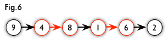

# 图论

[TOC]


## 二分图

### 性质

**二分图不存在长度为奇数的环**

因为每一条边都是从一个集合走到另一个集合，只有走偶数次才可能回到同一个集合。

## 二分图最大匹配




**交替路**：从一个未匹配点出发，依次经过非匹配边、匹配边、非匹配边…形成的路径叫交替路。

**增广路**：从一个未匹配点出发，走交替路，如果途径另一个未匹配点（出发的点不算），则这条交替路称为增广路（agumenting path）。例如，图 5 中的一条增广路如图 6 所示（图中的匹配点均用红色标出）

**匈牙利算法**：不停地找增广路，找到一条增广路，就把其中匹配边变非匹配，非匹配边变成匹配。[<sup>1</sup>](#refer-anchor-1)

### DFS邻接矩阵版匈牙利算法（hdu2063）

```c++
//
// Created by Jiang Yinzuo on 2020/7/15.
//

#include <cstdio>
#include <cstring>

bool graph[501][501]; /* 邻接矩阵存有向图 u -> v */
bool matched[501];    /* 一次dfs中，v是否已经同一个u匹配 */
int link_u[501];      /* 点v同哪个u匹配 */

bool dfs(int u, int v_num) {
    for (int v = 1; v <= v_num; ++v) {
        if (graph[u][v] && !matched[v]) {
            matched[v] = true;
            if (link_u[v] == -1 || dfs(link_u[v], v_num)) {
                link_u[v] = u;
                return true;
            }
        }
    }
    return false;
}

/**
 * 匈牙利算法求二分图最大匹配。（左右两边点的编号均从1开始）
 * @param u_num 左边一组点的个数
 * @param v_num 右边一组点的个数
 * @return 最大匹配数
 */
int hungary(int u_num, int v_num) {
    int result = 0;
    memset(link_u, -1, sizeof(link_u));

    for (int i = 1; i <= u_num; ++i) {
        memset(matched, false, sizeof(matched));
        if (dfs(i, v_num)) ++result;
    }
    return result;
}

int main() {
    int k, m, n;
    while (scanf("%d", &k) && k) {
        scanf("%d %d", &m, &n);
        memset(graph, false, sizeof(graph));

        int u, v;
        while (k--) {
            scanf("%d %d", &u, &v);
            graph[u][v] = true;
        }
        printf("%d\n", hungary(m, n));
    }
    return 0;
}
```

## 二分图最大权匹配:  KM算法，复杂度O(n^3)

考虑到二分图中两个集合中的点并不总是相同，为了能应用 KM 算法解决二分图的最大权匹配，需要先作如下处理：将两个集合中点数比较少的补点，使得两边点数相同，再将不存在的边权重设为 0，这种情况下，问题就转换成求 **最大权完美匹配问题** ，从而能应用 KM 算法求解。


给定一张二分图，左右部均有 n 个点，共有 m 条带权边，且保证有完美匹配。

求一种完美匹配的方案，使得最终匹配边的边权之和最大。

输出第一行表示答案。第二行共 *n* 个整数 $$a_1,a_2,a_3\cdots a_n$$，其中 $$a_i$$表示完美匹配下与**右部**第 i 个点相匹配的左部点的编号。

```c++
//
// Created by Jiang Yinzuo on 2020/9/28.
//

#include <cstdio>
#include <cstring>

class KM {

#define MAX_N 605
#define INF 0x3f3f3f3f

public:
    static long long graph[MAX_N][MAX_N]; // 边权邻接矩阵
private:
    static long long lx[MAX_N], ly[MAX_N], slack[MAX_N], pre[MAX_N];
    static int linker[MAX_N]; // linker[i]：与右边第i个点相匹配的左边的点
    static bool vis_y[MAX_N]; // 标记右边点集是否被访问过

    static void bfs(int k, int n);

public:
    static long long solve(int n);

    static void print_linker(int n) {
        for (int i = 1; i <= n - 1; ++i) {
            printf("%d ", KM::linker[i]);
        }
        printf("%d\n", KM::linker[n]);
    }
};

long long KM::graph[MAX_N][MAX_N]; // 边权邻接矩阵
long long  KM::lx[MAX_N], KM::ly[MAX_N], KM::slack[MAX_N], KM::pre[MAX_N];
bool KM::vis_y[MAX_N];
int KM::linker[MAX_N];

void KM::bfs(int k, int n) {
    long long x, y = 0, yy = 0, delta;
    memset(pre, 0, sizeof(pre));
    for (int i = 1; i <= n; i++) slack[i] = INF;
    linker[y] = k;
    while (true) {
        x = linker[y];
        delta = INF;
        vis_y[y] = true;
        for (int i = 1; i <= n; i++) {
            if (!vis_y[i]) {
                if (slack[i] > lx[x] + ly[i] - graph[x][i]) {
                    slack[i] = lx[x] + ly[i] - graph[x][i];
                    pre[i] = y;
                }
                if (slack[i] < delta) delta = slack[i], yy = i;
            }
        }
        for (int i = 0; i <= n; i++) {
            if (vis_y[i]) lx[linker[i]] -= delta, ly[i] += delta;
            else slack[i] -= delta;
        }
        y = yy;
        if (linker[y] == -1) break;
    }
    while (y) linker[y] = linker[pre[y]], y = pre[y];
}

long long KM::solve(int n) {
    memset(lx, 0, sizeof(lx));
    memset(ly, 0, sizeof(ly));
    memset(linker, -1, sizeof(linker));
    for (int i = 1; i <= n; i++) {
        memset(vis_y, false, sizeof(vis_y));
        bfs(i, n);
    }
    long long res = 0;
    for (int i = 1; i <= n; i++) {
        if (linker[i] != -1) {
            res += graph[linker[i]][i];
        }
    }
    return res;
}

int main() {
    int n;
    static long long m, x, y, weight;
    scanf("%lld %lld", &n, &m);
    for (int i = 1; i <= n; i++)
        for (int j = 1; j <= n; j++)
            KM::graph[i][j] = -INF;
    for (int i = 0; i < m; ++i) {
        scanf("%lld %lld %lld", &x, &y, &weight);
        KM::graph[x][y] = weight;
    }

    printf("%lld\n", KM::solve(n));
    KM::print_linker(n);
    return 0;
}
```

2019南京区域赛spy

```c++
#include <cstdio>
#include <cstring>

class KM {

#define MAX_N 605
#define INF 0x3f3f3f3f

public:
    static long long graph[MAX_N][MAX_N]; // 边权邻接矩阵

private:
    static long long lx[MAX_N], ly[MAX_N], linker[MAX_N], slack[MAX_N], pre[MAX_N];
    static bool vis_y[MAX_N]; // 标记右边点集是否被访问过

    static void bfs(long long k, int n);

public:
    static long long solve(int n);
};


long long KM::graph[MAX_N][MAX_N]; // 边权邻接矩阵
long long  KM::lx[MAX_N], KM::ly[MAX_N], KM::linker[MAX_N], KM::slack[MAX_N], KM::pre[MAX_N];
bool  KM::vis_y[MAX_N];

void KM::bfs(long long k, int n) {
    long long x, y = 0, yy = 0, delta;
    memset(pre, 0, sizeof(pre));
    for (int i = 1; i <= n; i++) slack[i] = INF;
    linker[y] = k;
    while (true) {
        x = linker[y];
        delta = INF;
        vis_y[y] = true;
        for (int i = 1; i <= n; i++) {
            if (!vis_y[i]) {
                if (slack[i] > lx[x] + ly[i] - graph[x][i]) {
                    slack[i] = lx[x] + ly[i] - graph[x][i];
                    pre[i] = y;
                }
                if (slack[i] < delta) delta = slack[i], yy = i;
            }
        }
        for (int i = 0; i <= n; i++) {
            if (vis_y[i]) lx[linker[i]] -= delta, ly[i] += delta;
            else slack[i] -= delta;
        }
        y = yy;
        if (linker[y] == -1) break;
    }
    while (y) linker[y] = linker[pre[y]], y = pre[y];
}

long long KM::solve(int n) {
    memset(lx, 0, sizeof(lx));
    memset(ly, 0, sizeof(ly));
    memset(linker, -1, sizeof(linker));
    for (int i = 1; i <= n; i++) {
        memset(vis_y, false, sizeof(vis_y));
        bfs(i, n);
    }
    long long res = 0;
    for (int i = 1; i <= n; i++) {
        if (linker[i] != -1) {
            res += graph[linker[i]][i];
        }
    }
    return res;
}

int main() {
    static long long  a[MAX_N], b[MAX_N], c[MAX_N], p[MAX_N];
    int n;
    scanf("%d", &n);
    for (int i = 1; i <= n; i++) scanf("%lld", &a[i]);
    for (int i = 1; i <= n; i++) scanf("%lld", &p[i]);
    for (int i = 1; i <= n; i++) scanf("%lld", &b[i]);
    for (int i = 1; i <= n; i++) scanf("%lld", &c[i]);
    for (int i = 1; i <= n; i++) {
        for (int j = 1; j <= n; j++) {
            long long s = 0;
            for (int k = 1; k <= n; k++) {
                if (b[i] + c[j] > a[k]) s += p[k];
            }
            KM::graph[i][j] = s;
        }
    }

    printf("%lld\n", KM::solve(n));
    return 0;
}
```


## 网络流

### 最大流

#### Dinic

时间复杂度：$$O(n^2m)$$

BFS构造分层图。DFS根据分层往下遍历，回溯时更新边权。

[洛谷P3376](https://www.luogu.com.cn/problem/solution/P3376)

```c++
#include <cstdio>
#include <queue>
#include <algorithm>

#define MAX_V_NUM 200
#define MAX_E_NUM 5000

const int INF = 0x3fffffff;
int edge_idx = 1, start_head[MAX_V_NUM + 4];

/* 2、3是一对反向边；4、5是一对反向边... */
struct Edge {
    int to, next, remain_capacity;
    static int head[MAX_V_NUM + 4];
} edges[MAX_E_NUM * 2 + 4];

int Edge::head[MAX_V_NUM + 4] = {0};

int depth[MAX_V_NUM + 4];

/**
 * 添加双向边
 * @param u 起点
 * @param v 终点
 * @param w 边权
 */
static void add_edges(int u, int v, int w) {
    edges[++edge_idx] = {v, Edge::head[u], w};
    Edge::head[u] = edge_idx;

    edges[++edge_idx] = {u, Edge::head[v], 0};
    Edge::head[v] = edge_idx;
}


/* 在残量网络中构造分层图 */
bool bfs(int source, int n, int target) {
    for (int i = 1; i <= n; i++) depth[i] = INF;
    std::queue<int> q;
    q.push(source);
    depth[source] = 0;
    start_head[source] = Edge::head[source];
    while (!q.empty()) {
        int x = q.front();
        q.pop();
        for (int i = Edge::head[x]; i; i = edges[i].next) {
            int v = edges[i].to;
            if (edges[i].remain_capacity > 0 && depth[v] == INF) {
                q.push(v);
                start_head[v] = Edge::head[v];
                depth[v] = depth[x] + 1;
                if (v == target) return true;
            }
        }
    }
    return false;
}

/**
 * 只对下一层级的点进行dfs
 * @param cur_v 当前所在的点
 * @param cur_min_flow 增广路上最小的边权(剩余容量)
 * @return 经过cur_v流出的总容量
 */
int dfs(int cur_v, int cur_min_flow, const int target) {
    if (cur_v == target) return cur_min_flow;
    // min_flow是当前最小的剩余容量
    int min_flow, result = 0;
    for (int i = start_head[cur_v]; i && cur_min_flow > 0; i = edges[i].next) {
        // 当前弧优化
        start_head[cur_v] = i;
        int next_v = edges[i].to;
        if (edges[i].remain_capacity > 0 && (depth[next_v] == depth[cur_v] + 1)) {
            min_flow = dfs(next_v, std::min(cur_min_flow, edges[i].remain_capacity), target);
            // 剪枝，去掉增广完毕的点
            if (min_flow == 0) depth[next_v] = INF;
            edges[i].remain_capacity -= min_flow;
            edges[i ^ 1].remain_capacity += min_flow;
            result += min_flow;
            cur_min_flow -= min_flow;
        }
    }
    return result;
}


int main() {
    int n, m, source, target;
    scanf("%d %d %d %d", &n, &m, &source, &target);
    int u, v, w;
    for (int i = 1; i <= m; i++) {
        scanf("%d %d %d", &u, &v, &w);
        add_edges(u, v, w);
    }

    long long ans = 0;
    while (bfs(source, n, target)) {
        ans += dfs(source, INF, target);
    }
    printf("%lld\n", ans);
    return 0;
}

```

## 最短路

### Dijkstra

```c++
//
// Created by Jiang Yinzuo on 2020/3/8.
// hdu2544

#include <cstdio>
#include <queue>
#include <cstring>

const long long MAX_LONG_LONG = 9223372036854775807;

struct Edge {
    static int edge_idx;
    static int heads[100005];
    int to;
    long long distance;
    int next;

    bool operator<(Edge &e) const {
        return distance < e.distance;
    }
} edges[200005];

int Edge::edge_idx = 0;
int Edge::heads[100005] = {0};

struct Vertex {
    int v;
    long long distance;

    Vertex(int v, long long distance) : v(v), distance(distance) {}

    bool operator<(const Vertex &vertex) const {
        return distance > vertex.distance;
    }
};

void add_edge(int from, int to, long long distance) {
    edges[++Edge::edge_idx] = {to, distance, Edge::heads[from]};
    Edge::heads[from] = Edge::edge_idx;
}


long long distance[100005];
bool visited[100005];

void dijkstra(int vertex_count) {

    memset(visited, false, sizeof(visited));
    distance[1] = 0;
    for (int i = 2; i <= vertex_count; ++i) {
        distance[i] = MAX_LONG_LONG;
    }

    std::priority_queue<Vertex> vertex_queue;

    // 1是起点
    vertex_queue.push({1, 0});

    while (!vertex_queue.empty()) {
        Vertex cur_v = vertex_queue.top();
        vertex_queue.pop();
        if (visited[cur_v.v]) continue;

        // 搜索到终点结束
        if (cur_v.v == vertex_count) break;

        visited[cur_v.v] = true;

        for (int i = Edge::heads[cur_v.v]; i; i = edges[i].next) {
            if (!visited[edges[i].to] && distance[edges[i].to] > distance[cur_v.v] + edges[i].distance) {
                distance[edges[i].to] = distance[cur_v.v] + edges[i].distance;
                vertex_queue.push({edges[i].to, distance[edges[i].to]});
            }
        }
    }
    printf("%lld\n", distance[vertex_count]);
}

int main() {
    int vertex_count, road_count;

    int from, to, tmp_dis;
    while (~scanf("%d %d", &vertex_count, &road_count) && vertex_count && road_count) {
        Edge::edge_idx = 0;
        memset(Edge::heads, 0, sizeof(Edge::heads));

        for (int i = 0; i < road_count; ++i) {
            scanf("%d %d %d", &from, &to, &tmp_dis);
            add_edge(from, to, tmp_dis);
            add_edge(to, from, tmp_dis);
        }
        dijkstra(vertex_count);
    }
    return 0;
}
```

### Floyd

```c++
//
// Created by Jiang Yinzuo on 2020/7/18.
// hdu2544

#include <cstdio>
#include <algorithm>

const int INF = 0x3f3f3f3f;
int graph[100][100];

void floyd(int n) {
    for (int k = 1; k <= n; ++k) {
        for (int i = 1; i <= n; ++i) {
            for (int j = 1; j <= n; ++j) {
                graph[i][j] = std::min(graph[i][j], graph[i][k] + graph[k][j]);
            }
        }
    }
}

int main() {
    int n, m;
    while (~scanf("%d %d", &n, &m) && n && m) {
        int u, v, w;
        for (int i = 1; i <= n; ++i) {
            for (int j = 1; j <= n; ++j) {
                graph[i][j] = INF;
            }
        }
        for (int i = 0; i < m; ++i) {
            scanf("%d %d %d", &u, &v, &w);
            graph[u][v] = graph[v][u] = w;
        }
        floyd(n);
        printf("%d\n", graph[1][n]);
    }

    return 0;
}
```


### SPFA

```c++
//
// Created by Jiang Yinzuo on 2020/7/19.
// luogu3371

#include <cstdio>
#include <queue>

#define MAX_V_NUM 10000
#define MAX_EDGE_NUM 500000

const int INF = 0x7fffffff;

struct Edge {
    int to, next, weight;
    static int idx;
    static int head[MAX_V_NUM + 2];
} edges[MAX_EDGE_NUM + 2];

int Edge::idx = 0;
int Edge::head[MAX_V_NUM + 2] = {0};

inline void add_edge(int u, int v, int weight) {
    edges[++Edge::idx] = {v, Edge::head[u], weight};
    Edge::head[u] = Edge::idx;
}

int distance[MAX_V_NUM + 2];

void spfa(int n, int start_v) {

    static bool in_queue[MAX_V_NUM + 2];
    for (int i = 0; i <= n; ++i) {
        distance[i] = INF;
        in_queue[i] = false;
    }
    std::queue<int> v_queue;
    v_queue.push(start_v);
    in_queue[start_v] = true;
    distance[start_v] = 0;

    while (!v_queue.empty()) {
        int cur_v = v_queue.front();
        v_queue.pop();
        in_queue[cur_v] = false;
        for (int i = Edge::head[cur_v]; i; i = edges[i].next) {
            int to = edges[i].to;
            if (distance[cur_v] + edges[i].weight < distance[to]) {
                distance[to] = distance[cur_v] + edges[i].weight;
                if (!in_queue[to]) {
                    v_queue.push(to);
                    in_queue[to] = true;
                }
            }
        }
    }
}

int main() {
    int n, m, start;
    scanf("%d %d %d", &n, &m, &start);

    int u, v, weight;
    for (int i = 0; i < m; ++i) {
        scanf("%d %d %d", &u, &v, &weight);
        add_edge(u, v, weight);
    }
    spfa(n, start);
    for (int i = 1; i <= n; ++i) {
        printf("%d%c", distance[i], (i != n ? ' ' : '\n'));
    }
    return 0;
}
```

## 差分约束与判负环

**差分约束系统** 是一种特殊的$$n$$元一次不等式组，它包含$$n$$个变量$$x_1,x_2,...,x_n$$以及$$m$$个约束条件，每个约束条件是由两个其中的变量做差构成的，形如 $$x_i - x_j \le c_k$$，其中$$c_k$$ 是常数（可以是任意整数）。我们要解决的问题是：求一组解$$x_1=a_1, x_2=a_2,...,x_n = a_n$$ ，使得所有的约束条件得到满足，否则判断出无解。

差分约束系统中的每个约束条件 $$x_i - x_j \le c_k$$ 都可以变形成 $$x_i \le x_j + c_k$$ ，这与单源最短路中的三角形不等式$$dist[y] \le dist[x] + z$$ 非常相似。因此，我们可以把每个变量$$x_i$$ 看做图中的一个结点，对于每个约束条件$$x_i - x_j \le c_k$$ ，从结点$$j$$ 向结点$$i$$ 连一条长度为 $$c_k$$的有向边。

注意到，如果$${a_1, a_2, ...,a_n}$$ 是该差分约束系统的一组解，那么对于任意的常数$$d$$ ，$${a_1 + d, a_2 + d, ...,a_n + d}$$ 显然也是该差分约束系统的一组解，因为这样做差后$$d$$ 刚好被消掉。

设$$dist[0] = 0$$ 并向每一个点连一条边，跑单源最短路，若图中存在负环，则给定的差分约束系统无解，否则，$$x_i = dist[i]$$ 为该差分约束系统的一组解。

一般使用 Bellman-Ford 或队列优化的 Bellman-Ford（俗称 SPFA，在某些随机图跑得很快）判断图中是否存在负环，最坏时间复杂度为$$O(nm)$$ 。

| 题意                | 转换                                        | 加边                                |
| ------------------- | ------------------------------------------- | ----------------------------------- |
| $$x_a - x_b \ge c$$ | $$x_b - x_a \le -c$$                        | add_edge(a, b, -c)                  |
| $$x_a - x_b \le c$$ | $$x_a - x_b \le c$$                         | add_edge(b, a, c)                   |
| $$x_a = x_b$$       | $$x_a - x_b \le 0, \space x_b - x_a \le 0$$ | add_edge(b, a, 0) add_edge(a, b, 0) |

```c++
//
// Created by Jiang Yinzuo on 2020/7/19.
// luogu 1993

#include <cstdio>
#include <queue>

#define MAX_V_NUM 10000
#define MAX_EDGE_NUM 500000

const int INF = 0x7fffffff;

struct Edge {
    int to, next, weight;
    static int idx;
    static int head[MAX_V_NUM + 2];
} edges[MAX_EDGE_NUM + 2];

int Edge::idx = 0;
int Edge::head[MAX_V_NUM + 2] = {0};

inline void add_edge(int u, int v, int weight) {
    edges[++Edge::idx] = {v, Edge::head[u], weight};
    Edge::head[u] = Edge::idx;
}

int distance[MAX_V_NUM + 2];

/**
 * 判断是否有负环
 * @param n 图中点的个数
 * @param start_v 起点
 * @return 有负环: true; 没有: false
 */
bool spfa(int n, int start_v) {

    static bool in_queue[MAX_V_NUM + 2];
    static int count[MAX_V_NUM + 2];
    for (int i = 0; i <= n; ++i) {
        distance[i] = INF;
        in_queue[i] = false;
        count[i] = 0;
    }
    std::queue<int> v_queue;
    v_queue.push(start_v);
    in_queue[start_v] = true;
    distance[start_v] = 0;

    while (!v_queue.empty()) {
        int cur_v = v_queue.front();
        v_queue.pop();
        in_queue[cur_v] = false;
        for (int i = Edge::head[cur_v]; i; i = edges[i].next) {
            int to = edges[i].to;
            if (distance[cur_v] + edges[i].weight < distance[to]) {
                distance[to] = distance[cur_v] + edges[i].weight;
                if (++count[to] >= n) return true;
                if (!in_queue[to]) {
                    v_queue.push(to);
                    in_queue[to] = true;
                }
            }
        }
    }
    return false;
}

int main() {
    int n, m;
    scanf("%d %d", &n, &m);

    int op, u, v, c;
    for (int i = 0; i < m; ++i) {
        scanf("%d", &op);
        if (op == 1) {
            scanf("%d %d %d", &u, &v, &c);
            add_edge(u, v, -c);
        } else if (op == 2) {
            scanf("%d %d %d", &u, &v, &c);
            add_edge(v, u, c);
        } else {
            scanf("%d %d", &u, &v);
            add_edge(u, v, 0);
            add_edge(v, u, 0);
        }
    }
    // 保证图是连通的
    for (int i = 1; i <= n; ++i)
        add_edge(n + 1, i, 0);
    puts(spfa(n + 1, n + 1) ? "No" : "Yes");
    return 0;
}
```

#### SPFA判负环

```c++
//
// Created by Jiang Yinzuo on 2020/7/19.
// luogu p3385

#include <cstdio>
#include <queue>

#define MAX_V_NUM 2003
#define MAX_EDGE_NUM 6003

const int INF = 0x7fffffff;

struct Edge {
    int to, next, weight;
    static int idx;
    static int head[MAX_V_NUM + 2];
} edges[MAX_EDGE_NUM + 2];

int Edge::idx = 0;
int Edge::head[MAX_V_NUM + 2] = {0};

inline void add_edge(int u, int v, int weight) {
    edges[++Edge::idx] = {v, Edge::head[u], weight};
    Edge::head[u] = Edge::idx;
}

int distance[MAX_V_NUM + 2];

/**
 * 判断是否有负环
 * @param n 图中点的个数
 * @param start_v 起点
 * @return 有负环: true; 没有: false
 */
bool spfa(int n, int start_v) {

    static bool in_queue[MAX_V_NUM + 2];
    static int count[MAX_V_NUM + 2];
    for (int i = 0; i <= n; ++i) {
        distance[i] = INF;
        in_queue[i] = false;
        count[i] = 0;
    }
    std::queue<int> v_queue;
    v_queue.push(start_v);
    in_queue[start_v] = true;
    distance[start_v] = 0;

    while (!v_queue.empty()) {
        int cur_v = v_queue.front();
        v_queue.pop();
        in_queue[cur_v] = false;
        for (int i = Edge::head[cur_v]; i; i = edges[i].next) {
            int to = edges[i].to;
            if (distance[cur_v] + edges[i].weight < distance[to]) {
                distance[to] = distance[cur_v] + edges[i].weight;
                if (++count[to] >= n) return true;
                if (!in_queue[to]) {
                    v_queue.push(to);
                    in_queue[to] = true;
                }
            }
        }
    }
    return false;
}

int main() {
    int t;
    scanf("%d", &t);
    while (t--) {
        int n, m;
        scanf("%d %d", &n, &m);
        Edge::idx = 0;
        for (int i = 0; i <= n; ++i) Edge::head[i] = 0;
        int u, v, w;
        for (int i = 0; i < m; ++i) {
            scanf("%d %d %d", &u, &v, &w);
            add_edge(u, v, w);
            if (w >= 0) {
                add_edge(v, u, w);
            }
        }

        puts(spfa(n, 1) ? "YES" : "NO");
    }

    return 0;
}
```

## 最小生成树

Prim在稠密图中比Kruskal优，在稀疏图中比Kruskal劣

### Prim

O(E + VlgV)

```C++
//
// Created by Jiang Yinzuo on 2020/7/18.
// luogu p3366

#include <cstdio>
#include <queue>
#include <cstring>

#define MAX_V_NUM 5000
#define MAX_E_NUM 200000

const int INF = 0x7fffffff;

struct Edge {
    int to, next, weight;
    static int idx;
    static int head[MAX_V_NUM + 1];

    bool operator<(const Edge &e) const {
        return this->weight < e.weight;
    }
} edges[MAX_E_NUM * 2 + 1];

int Edge::idx = 0;
int Edge::head[MAX_V_NUM + 1] = {0};

static inline void add_edge(int u, int v, int weight) {
    edges[++Edge::idx] = {v, Edge::head[u], weight};
    Edge::head[u] = Edge::idx;
}

/**
 * prim算法求最小生成树
 * @param n 图中点的个数
 * @return 最小生成树的权值之和。返回-1表示图不连通
 */
int prim(int n) {

    static bool added_v[MAX_V_NUM + 1];
    static int min_weight[MAX_V_NUM + 1];
    for (int i = 0; i <= n; ++i) min_weight[i] = INF;
    memset(added_v, false, sizeof(added_v));
    int added_v_num = 1;
    int cur_v = 1;
    int result = 0;
    added_v[cur_v] = true;
    std::priority_queue<std::pair<int, int>, std::vector<std::pair<int, int>>, std::greater<> > queue;
    for (int i = Edge::head[cur_v]; i; i = edges[i].next) {
        queue.push({edges[i].weight, edges[i].to});
    }
    while (!queue.empty() && added_v_num < n) {
        auto edge = queue.top();
        queue.pop();
        if (added_v[edge.second]) continue;
        added_v[edge.second] = true;
        result += edge.first;
        added_v_num++;
        for (int i = Edge::head[edge.second]; i; i = edges[i].next) {
            if (!added_v[edges[i].to] && edges[i].weight < min_weight[edges[i].to]) {
                min_weight[edges[i].to] = edges[i].weight;
                queue.push({edges[i].weight, edges[i].to});
            }
        }
    }
    if (added_v_num < n) return -1;
    return result;
}

int main() {
    int n, m;
    scanf("%d %d", &n, &m);
    int u, v, w;
    for (int i = 0; i < m; ++i) {
        scanf("%d %d %d", &u, &v, &w);
        add_edge(u, v, w);
        add_edge(v, u, w);
    }
    int result = prim(n);
    if (result >= 0) printf("%d\n", result);
    else {
        printf("orz\n");
    }
    return 0;
}
```

O(ElgV)

## 树

### dfs求两点距离

```c++
int dis;
void get_dis(int cur, int end, int father, int depth) {
    if (cur == end) {
        dis = depth;
        return;
    }
    for (auto i : tree[cur]) {
        if (i != father) {
            get_dis(i, end, cur, depth + 1);
        }
    }
}
```

### 倍增求LCA

```c++
/**
 * luogu3379
 */

#include <cstdio>
#include <algorithm>

using namespace std;

struct Edge {
    int v;
    int next;
} edges[500002 << 1];
int heads[500002];
int total = 0;

int depth[500002] = {0};
int ancestors[500002][22] = {0};

int LOG_2[500002];

void add_edge(int u, int v) {
    edges[++total] = {v, heads[u]};
    heads[u] = total;
}

void dfs(int cur_v, int parent) {
    ancestors[cur_v][0] = parent;
    depth[cur_v] = depth[parent] + 1;

    for (int i = 1; i <= LOG_2[depth[cur_v]]; ++i) {
        ancestors[cur_v][i] = ancestors[ancestors[cur_v][i-1]][i-1];
    }

    for (int i = heads[cur_v]; i; i = edges[i].next) {
        if (edges[i].v != parent) {
            dfs(edges[i].v, cur_v);
        }
    }
}

int lca(int a, int b) {
    if (depth[a] < depth[b]) {
        swap(a, b);
    }
    while (depth[a] > depth[b]) {
        a = ancestors[a][LOG_2[depth[a]-depth[b]]];
    }
    if (a == b) {
        return a;
    }
    for (int i = LOG_2[depth[a]]; i >= 0; --i) {
        if (ancestors[a][i] != ancestors[b][i]) {
            a = ancestors[a][i];
            b = ancestors[b][i];
        }
    }
    return ancestors[a][0];
}

void get_log_2() {
    LOG_2[1] = 0;
    for (int i = 2; i <= 500001; ++i) {
        LOG_2[i] = LOG_2[i>>1] + 1;
    }
}

int main() {
    get_log_2();

    int n, m, s;
    scanf("%d %d %d", &n, &m, &s);

    int x, y;
    for (int i = 0; i < n - 1; ++i) {
        scanf("%d %d", &x, &y);
        add_edge(x, y);
        add_edge(y, x);
    }

    dfs(s, 0);

    int a, b;
    for (int i = 0; i < m; ++i) {
        scanf("%d %d", &a, &b);
        printf("%d\n", lca(a, b));
    }

    return 0;
}
```

### 树的直径

#### 两次dfs

先从任意一点P出发，找离它最远的点Q，再从点Q出发，找离它最远的点W，W到Q的距离就是是的直径

```c++
int max_depth = 0;
int end1;
void get_diameter(int cur, int father, int depth) {
    if (tree[cur].size() == 1 && father != -1 && depth > max_depth) {
        max_depth = depth;
        end1 = cur;
    }
    for (auto i : tree[cur]) {
        if (i != father) {
            get_diameter(i, cur, depth + 1);
        }
    }
}

int main() {
    max_depth = 0;
    get_diameter(1, -1, 1);
    get_diameter(end1, -1, 1);
    int diameter = max_depth;
    return 0;
}
```

#### 树形DP

### 树的重心

#### 定义

对于树上的每一个点，计算其所有子树中最大的子树节点数，这个值最小的点就是这棵树的重心。

（这里以及下文中的“子树”都是指无根树的子树，即包括“向上”的那棵子树，并且不包括整棵树自身。）

#### 根据定义求树的重心

```c++
//
// Created by jiang on 2020/8/15.
// poj1655

#include <cstdio>
#include <vector>

std::vector<int> tree[200001];
int size[200001];
int max_size[200001];
int n;
int centroid, min_max_size;

void dfs(int cur_v, int father) {
    size[cur_v] = max_size[cur_v] = 1;
    for (auto &i : tree[cur_v]) {
        if (i != father) {
            dfs(i, cur_v);
            size[cur_v] += size[i];
            max_size[cur_v] = std::max(max_size[cur_v], size[i]);
        }
    }
    max_size[cur_v] = std::max(max_size[cur_v], n - size[cur_v]);
    if (min_max_size > max_size[cur_v]) {
        centroid = cur_v;
        min_max_size = max_size[cur_v];
    }
}

int main() {
    int t;
    scanf("%d", &t);
    while (t--) {
        int u, v;
        scanf("%d", &n);
        for (int i = 1; i <= n; ++i) tree[i].clear();
        for (int i = 0; i < n - 1; ++i) {
            scanf("%d %d", &u, &v);
            tree[u].push_back(v);
            tree[v].push_back(u);
        }
        min_max_size = 0x7fffffff;
        dfs(1, 0);
        printf("%d %d\n", centroid, min_max_size);
    }
    return 0;
}
```

#### 性质

1. 以树的重心为根时，所有子树的大小都不超过整棵树大小的一半。
2. 树中所有点到某个点的距离和中，到重心的距离和是最小的；如果有两个重心，那么到它们的距离和一样。
3. 把两棵树通过一条边相连得到一棵新的树，那么新的树的重心在连接原来两棵树的重心的路径上。
4. 在一棵树上添加或删除一个叶子，那么它的重心最多只移动一条边的距离。
5. 一棵树最多有两个重心，且这两个重心相邻。

#### 求所有子树的重心（徐州ICPC2019）

```c++
//
// Created by jiang on 2020/8/15.
// https://nanti.jisuanke.com/t/42552

#include <cstdio>
#include <vector>

#define MAXN 200001
std::vector<int> tree[MAXN];

/**
 * fathers: 每个节点的父亲
 * depth： 每个节点的深度
 * centroids: 每个子树深度较深的重心
 * size: 每个子树的节点数量
 */
int fathers[MAXN], depth[MAXN], centroids[MAXN], size[MAXN];

/**
 * 合并两棵子树的重心时，新的重心一定在子树重心的连线上
 * @param cur_v 合并后的根节点
 * @param c1 子树1的重心
 * @param c2 子树2的重心
 */
void merge(int cur_v, int c1, int c2) {
    while (depth[c1] > depth[cur_v] && size[c1] < size[cur_v] - size[c1])
        c1 = fathers[c1];
    while (depth[c2] > depth[cur_v] && size[c2] < size[cur_v] - size[c2])
        c2 = fathers[c2];
    centroids[cur_v] = depth[c1] > depth[c2] ? c1 : c2;
}

void dfs(int cur_v) {
    size[cur_v] = 1;
    centroids[cur_v] = cur_v;
    for (auto &i : tree[cur_v]) {
        if (i != fathers[cur_v]) {
            fathers[i] = cur_v;
            depth[i] = depth[cur_v] + 1;
            dfs(i);
            size[cur_v] += size[i];
            merge(cur_v, centroids[cur_v], centroids[i]);
        }
    }
}

int main() {
    int n;
    scanf("%d", &n);

    int u, v;
    for (int i = 0; i < n - 1; ++i) {
        scanf("%d %d", &u, &v);
        tree[u].push_back(v);
        tree[v].push_back(u);
    }
    fathers[1] = 0;
    depth[1] = 1;
    dfs(1);

    // 一棵树最多2个重心
    for (int i = 1; i <= n; ++i) {
        if (fathers[centroids[i]] && size[centroids[i]] * 2 == size[i]) {
            if (centroids[i] < fathers[centroids[i]])
                printf("%d %d\n", centroids[i], fathers[centroids[i]]);
            else
                printf("%d %d\n", fathers[centroids[i]], centroids[i]);
        } else {
            printf("%d\n", centroids[i]);
        }
    }
    return 0;
}
```

#### cf1406c：把有两个重心的树变成一个重心

找到一个重心的一边的叶子节点，和另一个重心相连。

```c++
//
// Created by jiang on 2020/9/17.
// 求树的重心

#include <cstdio>
#include <vector>

std::vector<int> tree[200001];
int size[200001];
int max_size[200001];
int n;
std::vector<int> centroids;
int min_max_size;

void dfs(int cur_v, int father) {
    size[cur_v] = max_size[cur_v] = 1;
    for (auto &i : tree[cur_v]) {
        if (i != father) {
            dfs(i, cur_v);
            size[cur_v] += size[i];
            max_size[cur_v] = std::max(max_size[cur_v], size[i]);
        }
    }
    max_size[cur_v] = std::max(max_size[cur_v], n - size[cur_v]);
    if (min_max_size >= max_size[cur_v]) {
        if (min_max_size > max_size[cur_v]) centroids.clear();
        centroids.push_back(cur_v);
        min_max_size = max_size[cur_v];
    }
}

int main() {
    int t;
    scanf("%d", &t);
    while (t--) {
        int u, v;
        scanf("%d", &n);
        for (int i = 1; i <= n; ++i) tree[i].clear();
        for (int i = 0; i < n - 1; ++i) {
            scanf("%d %d", &u, &v);
            tree[u].push_back(v);
            tree[v].push_back(u);
        }
        min_max_size = 0x7fffffff;
        dfs(1, 0);
        if (centroids.size() == 1) {
            printf("%d %d\n", tree[1][0], 1);
            printf("%d %d\n", tree[1][0], 1);
        } else {
            int c1 = centroids[0], c2 = centroids[1];
            int child, cur = c1, father = c2;
            while (tree[cur].size() > 1) {
                for (int i = 0; (child = tree[cur][i]) == father; ++i);
                father = cur;
                cur = child;
            }
            printf("%d %d\n", cur, father);
            printf("%d %d\n", cur, c2);
        }
    }
    return 0;
}
```

### 树链剖分

#### 定义

1.重儿子：一个节点的儿子节点里面，以重儿子为根的子树大小最大。

2.轻儿子：一个节点的儿子节点，除了**唯一**一个重儿子，其余儿子为轻儿子。

3.重边：连接父亲和重儿子的边称为重边。

4.轻边：连接父亲和轻儿子的边称为轻边。

5.重链：只由重边构成的链称为重链。

## 参考文献

<div id="refer-anchor-1"></div>- [1] [二分图匹配](https://www.renfei.org/blog/bipartite-matching.html)
